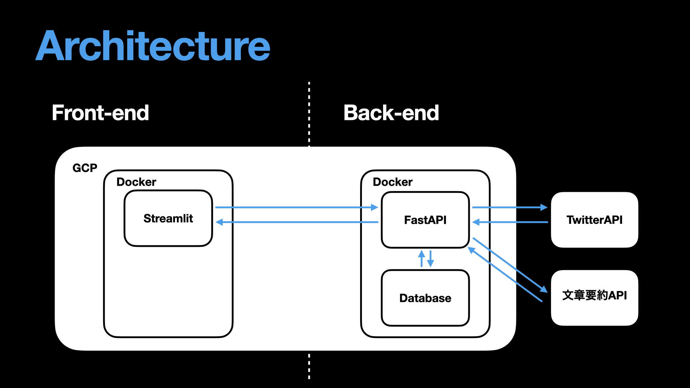

# DigLike

## 製品概要
DigLikeはTwitterのいいねを自動で整理し
空き時間に聞けるPodcastに変換するアプリです。

### 背景(製品開発のきっかけ、課題等）
* 後で、添付されていた論文を読もうとツイートに「いいね」をつけていたのに見つけられない。
* 面白そうな記事をTwitterで見つけたのに、結局見返さなかった。

なんていう体験をしたことはありませんか？
Twitterは情報収集ツールとして極めて優れているのにも関わらず、
再検索性に乏しく、収集した情報を整理し、消化することが難しいという課題があります。

### 製品説明（具体的な製品の説明）
DigLikeは、機械学習技術を用いて
* ツイートを自動で分類
* Podcastの自動作成

を行い、Twitterで収集した情報の管理、活用、消化をサポートします。

### 特長

#### 1. 特長1　
Username、TwitterID入力と簡単なアノテーションだけでセッティング完了。
自動でいいねしたツイートがDigLikeに取り込まれ、トピックごとに分類整理されます。
#### 2. 特長2　
DigLikeに取り込まれたツイートはトピックをもとに絞り込めます。
大量のいいねしたツイートの中からでも、簡単にあなたの探していたツイートを見つけ出すことができます。
#### 3. 特長3　
いいねしたツイートをもとに、あなただけのPodcastが生成されます。
通勤時やエクササイズ中など、あなたの好きな時に聞くことができ、情報のスタックはもう過去のものです。

### 解決出来ること
ツイートのいいね欄で雑多に散らばっていた情報を整理することができます。また、時間がなくてついつい見逃してしまっていたツイートも、ポッドキャスト形式で耳から密度の高い情報を取り入れることができます。
### 今後の展望
* いいねしたツイートのトピック検索だけでなく、添付URLの一致検索やキーワード検索なども実装したい
* ツイートの分類や音声生成機能を完全にAPIとして分離し、異なるインターフェースからもこのサービスを利用できるようにする。特に、Notionなどの既存のサービスと連携を注力して行う予定。
### 注力したこと（こだわり等）
* アノテーション用のトピック選択の画面でユーザーが自身でトピックを定義できるようにUIコンポーネントを設計したこと。
* できるだけユーザーのアノテーションの負担が少なくなるよう、少数データ（ツイート）でも適切に分類が行えるような最新の手法を取り入れた。結果、アノテーション数が3例ほどでも適切にツイートの分類を行えるようになっている。

## 開発技術

### 活用した技術
#### API・データ
* Twitter API
* 文章要約 API

#### フレームワーク・ライブラリ・モジュール
* Streamlit
* FastAPI
* Docker
* GCP

### 独自技術
#### ハッカソンで開発した独自機能・技術
- ツイートの自動分類、音声読み上げ機能

#### 製品に取り入れた研究内容（データ・ソフトウェアなど）
- Tunstall+'22 : Efficient Few-Shot Learning Without Prompts 
    - ツイートの分類に使用。Contrastive Learningを用いて少量データで高精度な分類性能を達成。
    - arxiv : https://arxiv.org/abs/2209.11055
    - software : https://github.com/huggingface/setfit

